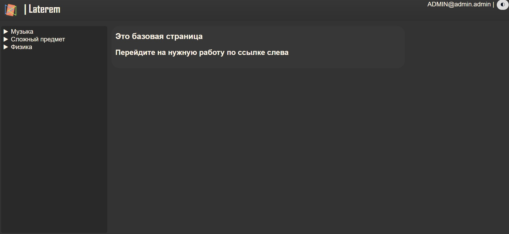
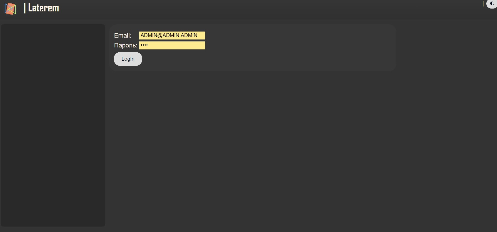
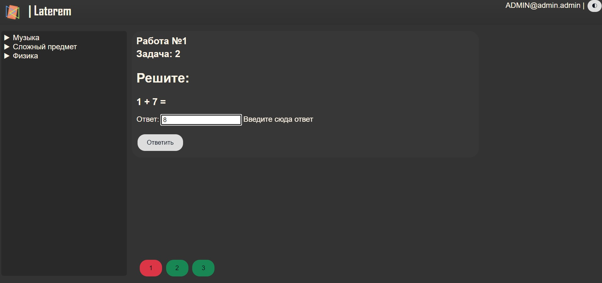
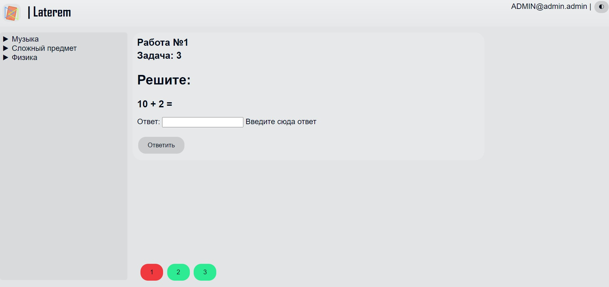

## 0. Перечень новвоведений 
- [Новое название проекта - **Laterem**](#название)
- [Проведена общая работа над **фронт-ендом**, отполирован внешний вид страниц](#2-демонстрация-обновления-дизайна)
    
    Обновления фронт-енда, заслуживающие отдельного внимания:
    - Добавлены **кнопки навигации** по задачам в работах 
    - **Панель навигации** по работам теперь интерактивная, категории работ представлены в виде **сворачивающегося списка**. 
    - Добавлена **шапка** сайта 
    - Добавлен **логотип** сайта 
    - Добавлен **фавикон** сайта 
    - Добавлена возможность смены **темы** сайта (сейчас реализована светлая тема и тёмная тема) 
    - На панель навигации по работам добавлено отображение общих **вердиктов работ**
- [Добавлена возможность легко встраивать **картинки** в задачи](#3-встраивание-внешних-файлов-в-задачи)
- [Добавлена **система пользователей**](#4-система-пользователей)
    - Добавлена система **авторизации**
    - Добавлена система хранения личных данных пользователей
    - [Добавлена система хранения **вердиктов** задач по пользователям](#вердикты)
    - Добавлена система доступности веток работ в зависимости от пользователя 
    - Добавлена система хранения личных настроек пользователя 

  
## 1. Бренд 
Мы признаём, что, возможно, заботиться о таких вещах на такой ранней стадии проекта было лишним. Однако по нашему мнению определиться с такими основными элементами бренда проекта было необходимым для дальнейшего развития. 
  
Для сайта было обновлено **название**, разработаны **основная палитра** и **логотип**. По нашей задумке, эти три детали внесут вклад в степень презентабельности сайта. Например, логотип и основная палитра значительно улучшают внешний вид страниц. 
  
### Название 
Долгое время рабочим названием проекта была аббревиатура DEW - Digital Electronics Web. Но это название перестало подходить проекту, когда начал рассматриваться потенциал развития проекта в сторону других предметов. 
В итоге проекту было выбрано новое название — **Laterem**. 
Laterem в переводе с латыни значит **«кирпич»** — народный **символ Е-профиля** и одновременно **метафора** на **гибкость** и **универсальность** сайта как движка, "строительного материала". 
К слову о своевременности принятия решения касательно названия: проводить рефакторинг внутри кода в соответствии с обновлением названия и терминов уже было достаточно трудозатратно. 
 
## 2. Демонстрация обновления дизайна 

### Базовая страница

### Вход в систему

### Внешний вид задач

## 3. Встраивание **внешних файлов** в задачи
Чтобы из файла **разметки задачи** `view.html` получить **путь к файлу**, который хранится в директории задачи, необходимо внутри разметки прописать **тэг шаблона** ``. Сайт автоматически подставит вместо тэга **путь к искомому файлу**, доступный рендереру. 

## 4. Система пользователей
В данный момент система реализована через **три** связанных друг с другом **хранилища данных**:
- Текстовый файл `data/userdata/auth.txt`, хранящий **соответствие логинов и паролей пользователей**. 
    Временное решение, принятое в целях доступности пополнения базы пользователей учителем. 
    Каждая **строка** в файле - отдельная **учётная запись** ученика. В строке через символ обратного слэша (\\) хранятся **email** и **пароль** пользователя. 
- **База данных**
    **Зашифрованное** БД, **дублирующее** файл `auth.txt`. Через неё происходит **взаимодействие** фреймворка с личными данными пользователя. 
- Файлы с **дополнительной информацией** пользователей. 
    Для каждого пользователя в базе пользователей создаётся файл `data/userdata/personal/<почта пользователя>.json`. В нём хранится дополнительная информация пользователей, такая как **список открытых пользователю уроков**, **личные настройки** пользователя и **вердикты задач**. 

### Вердикты
Вердикты хранятся в виде **строк из двух символов**. Система обозначения вердиктов не финальная, программно предусмотрена возможность **дальнейшего переименования** вердиктов без значительных изменений в коде. 
Текущие обозначения вердиктов:
- **OK** - "Okay" - Задача сдана полностью верно. 
- **PS** - "Partially solved" - Задача решена частично на неполный балл. 
- **ST** - "Sent" - Решение принято и ожидает проверки
- **WA** - "Wrong answer" - Задача сдана неверно
- **NA** - "No answer" - Задача не сдана.